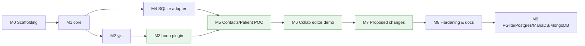

# YORM Implementation Plan

> Working plan for the first buildout described in [README.md](README.md).
> Three headline deliverables:
>
> 1. **`@yorm/hono`** — a pluggable Hono server component (plugin) that turns any Hono app into a YORM server.
> 2. **Contacts ⇄ FHIR Patient POC** — a phone-style contacts database (Apple `AddressBook.sqlitedb`-inspired schema) that syncs **losslessly** to and from a canonical FHIR `Patient` document.
> 3. **Collaborative Patient editor demo** — a React + Zustand app (two browsers editing the same Patient live) built on the [@mieweb/ui](https://github.com/mieweb/ui) design system with an [eSheet](https://github.com/mieweb/eSheet) form as the FHIR editor.
>
> **Strategy: vertical first, then horizontal.** The full stack ships on **SQLite only** through Milestone 8. Additional backends (PGlite, Postgres, MariaDB, MongoDB) land afterwards in Milestone 9, reusing the adapter conformance suite.

Status legend: `[ ]` todo · `[x]` done · `[~]` in progress

---

## Guiding constraints

- **Vertical first.** Every milestone through M8 runs end to end on SQLite. Horizontal backend expansion only begins after the SQLite vertical (including hardening) is done.
- **Smallest viable core.** Build only the slices of the README architecture that the deliverables need. No CLI, no XML codec, no Cloudflare runtime in this phase.
- **Adapters are replaceable** (README design principle #11). The adapter contract and conformance suite are written for N backends from day one, even though only SQLite is wired up in the vertical slice.
- **Lossless means round-trip equality.** `contacts DB → Patient → contacts DB` and `Patient → contacts DB → Patient` must both be verified by automated tests, including fields that have no natural home on the other side (preserved via FHIR extensions / a raw-properties sidecar table). Round trips are proven via import (contacts → Patient) plus forward projection (Patient → rows); **live reverse sync (SQL edits → Yjs via outbox) is deferred** to a later phase.
- **Script-first.** Everything CI runs must be runnable locally via `pnpm` scripts.

---

## Milestone 0 — Repository scaffolding

Goal: a pnpm monorepo where `pnpm install && pnpm build && pnpm test` works.

- [x] pnpm workspace: `packages/*`, `examples/*`, `fixtures/*` (matches README repository layout)
- [x] TypeScript project references, shared `tsconfig.base.json`, ESM output
- [x] Vitest at the root, per-package test scripts
- [x] Lint/format (eslint + prettier) with root scripts
- [x] CI workflow that is a thin wrapper over `pnpm build && pnpm lint && pnpm test`
- [x] Fixture folders: `fixtures/fhir-r4/patient/*.json`, `fixtures/contacts/*.json`

Exit criteria: green CI on an empty-but-wired monorepo.

---

## Milestone 1 — `@yorm/core` (minimum projection engine)

Goal: the deterministic object→rows engine, no I/O.

- [x] Mapping DSL: `defineMapping`, `one(...)`, `many(...)` with `key`/`values`/`rows` as in the README
- [x] `ProjectionPlanner`: object + mapping → deterministic plan (upserts, reconciliation deletes, checkpoint record)
- [x] Store interfaces (types only): `DocumentStore`, `ProjectionStore`, `Runtime`
- [x] Provenance/origin tags on plans (`yjs`, `sql`, `replay`, `projection`)
- [x] Column-ownership declaration (mapping only touches owned columns)
- [x] Mapping version field, immutability convention
- [x] Golden tests: object in → expected plan out (new doc, optional fields, repeated elements, removal, reorder, idempotent second run)

Exit criteria: golden tests pass; core has zero runtime dependencies on Hono/Drizzle/Yjs.

---

## Milestone 2 — `@yorm/yjs` (canonical document runtime)

Goal: real objects live in a `Y.Doc`; changes trigger projection.

- [x] JSON codec: `read(doc)` / `write(doc, value)` mapping plain objects ⇄ Yjs structures
- [x] `memoryRuntime()`: owns active docs, update fan-out, transaction boundaries
- [x] Document versioning: increment on each persisted update
- [x] `createYorm({ runtime, documents, projections, mappings })` orchestrator (may live in core, decide during M1)
- [x] Inline projection mode only (queued/batch deferred)
- [x] **Projection trigger policy** — decouple Yjs update persistence (always immediate, collaboration stays live) from projection commits. Policies: `every-change`, `on-blur`, `idle` (configurable ms, default 30 s), `explicit`. Implemented as a scheduler in front of the projection engine: coalesce document versions, project the latest state once per trigger, checkpoint records the version range covered
- [x] Policy is per-document-session (client-selectable) with a server-side default and an optional server max-lag cap (safety flush so `explicit` can't defer forever)
- [x] Tests: doc mutation → materialized object → plan → store calls, in order
- [x] Tests: burst of typing under `idle` policy produces exactly one projection; `explicit` projects only on flush; pending-changes state is observable

Exit criteria: an in-memory end-to-end (no DB) test edits a Y.Doc and observes correct projection-store calls.

---

## Milestone 3 — `@yorm/hono` plugin ⭐ deliverable 1

Goal: `app.route("/yorm", createHonoYorm(yorm))` gives any Hono app a YORM server.

- [x] `createHonoYorm(yorm, options)` returning a mountable `Hono` sub-app
- [x] HTTP API:
  - [x] `GET /docs/:type/:id` — materialized object (JSON snapshot)
  - [x] `PUT /docs/:type/:id` — write/replace document via codec (semantic transaction)
  - [x] `PATCH /docs/:type/:id` — partial semantic update
  - [x] `GET /docs/:type/:id/projection-state` — checkpoint/lag visibility, including pending (unprojected) changes under deferred policies
  - [x] `POST /docs/:type/:id/flush` — explicit save: project now (used by the `explicit` policy's Save button; also honored as blur/idle signal transport)
- [x] WebSocket endpoint `/ws/:type/:id` speaking y-protocols (sync + awareness), built on Hono's `upgradeWebSocket` abstraction so Node/Bun/Deno/CF work; tested on Node
- [x] Client can set/change the projection trigger policy for its session (query param or control message); server default + max-lag cap from plugin options
- [x] Plugin options: path prefix, auth hook (`onAuthorize(ctx, docId)`), codec selection per document type
- [x] No hard dependency on any DB package — the plugin only sees `Yorm` interfaces
- [x] Tests: HTTP round trips; two WebSocket clients converge on one document; unauthorized access rejected

Exit criteria: example Hono server in `examples/` runs, a `y-websocket` browser/Node client edits a Patient, rows appear in SQLite.

---

## Milestone 4 — Persistence adapter: SQLite (vertical slice)

Goal: one `DocumentStore` + `ProjectionStore` contract, proven on SQLite.

### 4a. Contract + shared conformance suite

- [x] `@yorm/drizzle`: `drizzleDocumentStore(db)`, `drizzleProjectionStore(db)` (dialect-agnostic where possible)
- [x] Reusable **adapter conformance test suite** (one test file parameterized over adapters): persist/load doc, apply plan transactionally, checkpoint advance, idempotent replay, reconciliation deletes — written to accept any adapter, so M9 backends only add wire-up
- [x] `yorm_document`, `yorm_update`, `yorm_projection_state` schema (outbox table deferred with reverse sync)

### 4b. SQLite wire-up

- [x] **SQLite** (`better-sqlite3`, Drizzle) — the default backend for the whole vertical slice
- [x] Backend selection plumbing (`YORM_DB=sqlite` for now) so M9 backends slot in without touching example code

Exit criteria: `pnpm test:adapters` passes on SQLite; conformance suite is adapter-parameterized.

---

## Milestone 5 — Contacts ⇄ FHIR Patient POC ⭐ deliverable 2

Goal: demonstrate lossless sync between a phone-style contacts DB and a canonical FHIR Patient document.

### 5a. `@yorm/fhir` (minimum slice)

- [x] FHIR JSON codec for `Patient` (generic resource codec, Patient-tested)
- [x] `fhirElementId(...)` stable element identity (explicit `id` → business key → ingestion-assigned id)
- [x] Extension preservation helpers (unmapped contact fields ride along as extensions)

### 5b. Contacts schema (Apple AddressBook-inspired)

- [ ] `contact` table — one row per person (first/last/middle/nickname, org, birthday, note, image ref…) ↔ `Patient.name`, `birthDate`, etc.
- [ ] `contact_multivalue` table — `(contact_id, element_id, property, label, value)` generic rows for phones, emails, URLs ↔ `Patient.telecom` (label ↔ `use`, property ↔ `system`)
- [ ] `contact_multivalue_entry` (structured multivalues) — addresses as key/value groups, Apple-style ↔ `Patient.address`
- [ ] `contact_raw_property` sidecar — anything with no FHIR mapping (e.g. ringtone, social profiles) so the DB side is also lossless on reverse sync

### 5c. Mapping `fhir.Patient@1`

- [ ] Forward: Patient → contact tables (names, telecom, address, birthDate, photo ref)
- [ ] Contacts **import codec**: seed a Patient document from an existing contacts DB (this is ingestion, not live reverse sync)
- [ ] Unmapped-on-purpose FHIR fields stay only in the canonical document (prove "keep the object")
- [ ] Unmapped contact fields → FHIR extensions under a documented URL namespace
- [ ] `direction: "forward"` for this phase — live reverse sync (outbox, `editable(...)`, triggers) is **deferred** (see Out of scope)

### 5d. Lossless verification (the actual thesis)

- [ ] Round-trip test A: seed contacts DB → import to Patient → project back to fresh contacts DB → **row equality** (raw-property sidecar carries anything unmappable)
- [ ] Round-trip test B: FHIR R4 Patient fixture → import path reconstructs Patient from projected rows + extensions → **deep-equal JSON** (modulo defined canonicalization)
- [ ] Concurrent Yjs edit test: two clients edit the same Patient; projections converge without loss
- [ ] Run 5d suite on SQLite (full backend matrix comes with M9)

### 5e. Example app `examples/fhir-patient-contacts`

- [ ] Hono server using `createHonoYorm` + SQLite by default
- [ ] Seed script with a handful of realistic contacts + Patient fixtures
- [ ] Small demo script (or minimal web page) showing: import contacts DB → Patient JSON appears; edit Patient over WebSocket → contact rows update
- [ ] README for the example with a Mermaid data-flow diagram

Exit criteria: `pnpm --filter example-fhir-patient-contacts demo` shows the round trip live; lossless test suite green on SQLite.

---

## Milestone 6 — Collaborative Patient editor demo ⭐ deliverable 3

Goal: two browsers editing the same FHIR Patient live — something a person can _see_ work.

App: `examples/patient-collab-demo` — Vite + React + Zustand, served alongside the Hono YORM server from M3/M5.

### 6a. Yjs ⇄ Zustand bridge

- [ ] Zustand store backed by the Patient `Y.Doc` (y-websocket provider → `/yorm/ws/Patient/:id`): Yjs updates set store state; store actions run as Yjs transactions (single source of truth is the doc; DRY — no duplicated state shape)
- [ ] Awareness → presence state in the store (who else is editing, cursors/field focus)

### 6b. FHIR editor via eSheet

- [ ] Patient form definition using `@esheet/core` + `@esheet/fields` (eSheet already uses Zustand stores and @mieweb/ui field components; leverage its FHIR support capability)
- [ ] Render with `<EsheetRenderer />` (builder not needed for the demo); wire eSheet responses ↔ the Yjs-backed Zustand store
- [ ] Field-level merge behavior verified: two browsers editing different fields both win; same field converges via CRDT

### 6c. UI shell with @mieweb/ui

- [ ] Layout, header, presence avatars, connection status with `@mieweb/ui` components; SCSS uses `--mieweb-*` design tokens only
- [ ] **Autosave policy dropdown** (`@mieweb/ui` select): "every change" / "on blur" / "idle – 30 second" / "explicit (save button)" — sets the session's projection trigger policy; Save button appears when `explicit` is selected; "unsaved projection changes" indicator driven by projection-state (label text externalized for i18n)
- [ ] Live projection panel: shows the SQLite `contact` / `contact_multivalue` rows updating as the Patient is edited (the "rows are projections" money shot) — which also makes the policy visible: rows update per keystroke on `every-change`, only on save under `explicit`
- [ ] Accessibility: ARIA labels on interactive elements, aria-live for presence/row updates

### 6d. Demo verification

- [ ] Playwright test: two browser contexts edit the same Patient, both converge, projection rows update
- [ ] Playwright test: under `on-blur` and `explicit` policies, both browsers still converge live over Yjs while SQL rows update only at the policy trigger
- [ ] `pnpm --filter patient-collab-demo dev` one-command startup (server + client)
- [ ] Example README with screenshot/clip and Mermaid data-flow diagram

Exit criteria: open two browser windows, edit name/phone in each, watch both UIs converge and the SQL rows update live.

---

## Milestone 7 — Proposed changes (suggestion mode)

Goal: one user edits directly; another can only **propose** changes. Tables reflect accepted state only; proposals are tracked until accepted or rejected.

Design: proposals live in the **same Y.Doc, separate subtree** (`yorm:proposals` — a Y.Map of semantic change intents: element path, proposed value, base value, actor, status, timestamps). They sync collaboratively and survive offline like any CRDT state, but the codec materializes only the canonical subtree, so the projection engine (and therefore SQL) never sees unaccepted changes. No Yjs forking/branching in v1; whole-document branch proposals are a possible future extension.

### 7a. Engine (`@yorm/yjs` + `@yorm/core`)

- [ ] Proposal model: `ChangeIntent { id, path, op (set/insert/remove), proposedValue, baseValue, baseDocumentVersion, actor, status: proposed|accepted|rejected|superseded, resolvedBy, resolvedAt }`
- [ ] Propose API: create/update/withdraw a proposal as a Yjs transaction on the proposals subtree (canonical resource untouched)
- [ ] Accept: apply the intent to the canonical subtree in one semantic Yjs transaction + mark proposal `accepted` (atomically, same transaction); projection then fires per the autosave policy
- [ ] Reject: mark `rejected`, canonical state untouched
- [ ] Stale handling: if the canonical value changed since `baseDocumentVersion`, surface the conflict (accept-anyway / reject / re-propose) — domain decision left to the caller
- [ ] Role hook: writer vs. proposer capability enforced server-side (M3 `onAuthorize` extended to per-subtree write rules — proposers' direct canonical edits are refused)

### 7b. Projection & tracking

- [ ] Canonical projection unchanged — only accepted state reaches `contact*` tables (this falls out of the codec reading only the canonical subtree; add a test proving pending proposals never appear in rows)
- [ ] Optional `yorm_proposal` **forward-only projection table** (proposal id, document, path, status, actor, timestamps) so DBAs/reports can see open proposals — dogfoods the mapping engine on YORM's own metadata

### 7c. Demo integration (`patient-collab-demo`)

- [ ] Role switcher: browser A = editor, browser B = proposer (`@mieweb/ui` toggle)
- [ ] Proposer's edits render as pending suggestions (visually distinct, ARIA-announced); editor sees an accept/reject review list
- [ ] Live rows panel demonstrates: proposal pending → no row change; accept → rows update; reject → nothing
- [ ] Playwright test: propose in B → rows unchanged → accept in A → rows update; reject path covered

Exit criteria: two-browser demo shows propose/accept/reject end to end with SQL reflecting only accepted state.

---

## Milestone 8 — Hardening & docs (completes the SQLite vertical)

- [ ] Mapping replay: `replay(mapping, { all })` used to rebuild the contacts projection from stored documents
- [ ] Projection failure recording (checkpoint `status`/`error`) + retry
- [ ] `docs/ARCHITECTURE.md`-style doc: what exists vs. README vision; adapter contract doc
- [ ] Trim README claims that this phase doesn't implement (or mark as roadmap)

---

## Milestone 9 — Horizontal: additional backends

Starts only after M8. Each backend = wire-up + the M4a conformance suite + the 5d lossless suite green.

- [ ] **PGlite** (`@electric-sql/pglite`, Drizzle pg dialect)
- [ ] **Postgres** (`postgres`/`pg`, Drizzle; docker-compose service)
- [ ] **MariaDB** (`mysql2`, Drizzle MySQL dialect; docker-compose service)
- [ ] **MongoDB** (`mongodb` driver, custom `@yorm/mongo` adapter — no Drizzle; projections become collections with the same reconcile semantics; documents/updates stored natively; single node, no multi-doc transaction guarantee — documented)
- [ ] CI: SQLite + PGlite always; Postgres/MariaDB/MongoDB behind docker-compose (same script locally and in CI)
- [ ] POC + demo switch backend with one env var (`YORM_DB=sqlite|pglite|postgres|mariadb|mongodb`)

Exit criteria: `pnpm test:adapters` and the 5d lossless suite pass on all five backends.

---

## Suggested build order & dependencies

Note: M4 (adapter contract + SQLite) can start in parallel with M2/M3. Everything through M8 is the SQLite vertical; M9 is the horizontal expansion.

---

## Decisions (finalized 2026-07-15)

1. **WebSocket runtime** — Hono `upgradeWebSocket` abstraction (portable across Node/Bun/Deno/CF); tested on Node.
2. **MongoDB scope** — lightweight proof: documents + reconcile-style projections, single node, no multi-doc transaction guarantee (documented).
3. **Reverse sync** — **deferred entirely** (no outbox, no `editable(...)`, no triggers this phase). Lossless thesis is proven via import + forward projection round trips.
4. **FHIR version** — R4 only.
5. **Contacts schema** — cleaned-up, Apple-inspired names (`contact`, `contact_multivalue`, `contact_multivalue_entry`) with documented correspondence to `ABPerson`/`ABMultiValue`.
6. **Package manager** — pnpm.
7. **Photos/binary** — image refs only.
8. **Vertical first** (2026-07-15) — complete the whole stack on SQLite through hardening (M8) before adding PGlite/Postgres/MariaDB/MongoDB (M9).
9. **Demo stack** (2026-07-15) — React + Zustand app, `@mieweb/ui` design system, eSheet (`@esheet/renderer` + `@esheet/fields`) as the FHIR Patient editor, y-websocket to the `@yorm/hono` server.
10. **Projection trigger policy** (2026-07-15) — Yjs updates always persist immediately (collaboration/versioning of the doc is unaffected); the SQL projection commit is gated by a per-session policy: `every-change` | `on-blur` | `idle` (default 30 s) | `explicit`. Reduces SQL churn while typing. Server enforces a max-lag safety flush.
11. **Proposed changes** (2026-07-15) — suggestion mode via semantic change intents in a `yorm:proposals` subtree of the same Y.Doc; codec/projection read only the canonical subtree, so SQL reflects accepted state only. Accept = one atomic Yjs transaction (apply + mark accepted). No Yjs document forking in v1.

---

## Out of scope for this phase

- **Reverse synchronization** (outbox, `yorm_change_outbox`, `OutboxProcessor`, bidirectional mappings, DB triggers) — deferred by decision #3.
- `@yorm/cli`, XML codec, Cloudflare Durable Objects runtime, queued projection mode, Redis/NATS runtime, multi-tenant auth, FHIR validation/terminology — all remain roadmap items from the README.
