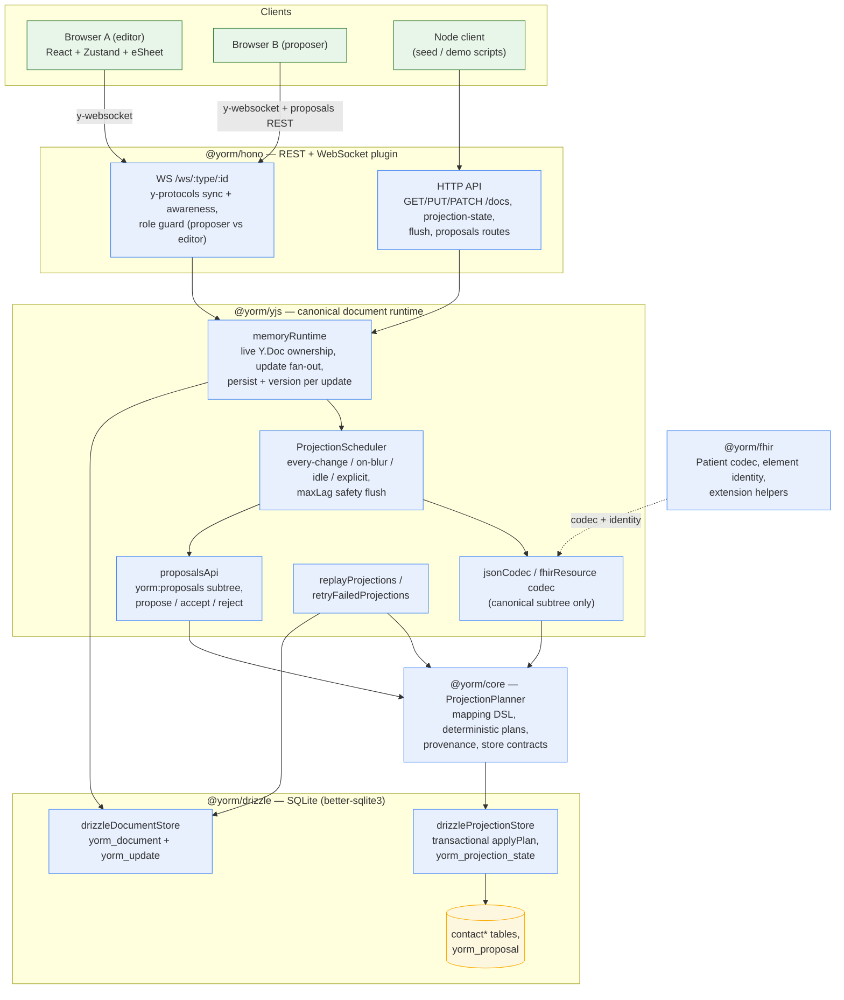

# YORM Architecture — what exists today

This document maps the implemented system (the SQLite vertical slice,
[PLAN.md](../PLAN.md) milestones M0–M8) against the design vision in the
[root README](../README.md). The README describes where YORM is going; this
document describes what is built, tested, and runnable right now. Per DRY,
package details live in the package READMEs — this page links rather than
restates.

## System diagram (as implemented)

Fixtures live in [fixtures/](../fixtures/README.md) (FHIR R4 Patient +
contacts examples); the two runnable examples are
[examples/fhir-patient-contacts](../examples/fhir-patient-contacts/README.md)
(lossless Contacts ⇄ FHIR Patient POC) and
[examples/patient-collab-demo](../examples/patient-collab-demo/README.md)
(two-browser collaborative editor with live SQL rows and suggestion mode).

## Implemented packages

All vitest counts from the current suite (165 tests total, plus 5 Playwright
e2e specs in the collab demo).

| Package                                                                      | Public API (main entry points)                                                                                                                                                    | Tests |
| ---------------------------------------------------------------------------- | --------------------------------------------------------------------------------------------------------------------------------------------------------------------------------- | ----- |
| [@yorm/core](../packages/core/README.md)                                     | `defineMapping`, `one`, `many`, `planProjection`, store contracts (`DocumentStore`, `ProjectionStore` incl. optional `listFailures`), `Origin` provenance                         | 26    |
| [@yorm/yjs](../packages/yjs/README.md)                                       | `createYorm`, `memoryRuntime`, `jsonCodec`, `applyJsonPatchLike`, `ProjectionScheduler`, `proposalsApi`, `proposalTrackingMapping`, `replayProjections`, `retryFailedProjections` | 63    |
| [@yorm/hono](../packages/hono/README.md)                                     | `createHonoYorm` (docs CRUD, projection-state, flush, proposals routes, `/ws` y-protocols endpoint, `onAuthorize`/`onAuthorizeWrite` hooks)                                       | 21    |
| [@yorm/drizzle](../packages/drizzle/README.md)                               | `createSqliteAdapter`, `drizzleDocumentStore`, `drizzleProjectionStore`, `adapterConformanceTests`, `resolveBackend` (`YORM_DB`)                                                  | 18    |
| [@yorm/fhir](../packages/fhir/README.md)                                     | `fhirResource` codec, `fhirElementId`, `ensureElementIds`, extension helpers                                                                                                      | 27    |
| [example-fhir-patient-contacts](../examples/fhir-patient-contacts/README.md) | POC server/seed/demo, `fhir.Patient@1` mapping, contacts import codec, round-trip + replay suites                                                                                 | 10    |
| [patient-collab-demo](../examples/patient-collab-demo/README.md)             | Vite + React + Zustand + eSheet demo (roles, policies, proposals, live rows panel)                                                                                                | 5 e2e |

## README vision vs. current state

The root README is intentionally the long-range design document. Honest map:

| README feature                                            | Current state                                                                                                                         |
| --------------------------------------------------------- | ------------------------------------------------------------------------------------------------------------------------------------- |
| Reverse sync (outbox, `editable(...)`, DB triggers)       | **Deferred** by [PLAN Decision #3](../PLAN.md#decisions-finalized-2026-07-15); lossless thesis proven via import + forward projection |
| Queued / batch projection modes                           | **Replay implemented** (`replayProjections`); durable queue mode deferred                                                             |
| XML codec                                                 | Roadmap (JSON + FHIR JSON codecs implemented)                                                                                         |
| `@yorm/cli` (`yorm inspect/plan/verify/repair`)           | Roadmap (replay/retry available as library APIs in `@yorm/yjs`)                                                                       |
| Cloudflare Durable Objects / Redis / NATS runtimes        | Roadmap (`memoryRuntime` only; the `Runtime` contract is the seam)                                                                    |
| Multi-backend persistence (PGlite/Postgres/MariaDB/Mongo) | Planned as [PLAN.md Milestone 9](../PLAN.md#milestone-9--horizontal-additional-backends); the conformance suite is ready              |
| FHIR validation / terminology                             | Out of scope by design (README "Non-goals")                                                                                           |
| Proposed changes (suggestion mode)                        | **Implemented** (M7): intents subtree, accept/reject/stale handling, role enforcement, `yorm_proposal` tracking projection            |
| Projection trigger policies                               | **Implemented** (Decision #10): see summary below                                                                                     |

## Adapter contract

The persistence contract is core's `DocumentStore` + `ProjectionStore`
([packages/core/src/stores](../packages/core/src/stores/index.ts)):

- **DocumentStore** — snapshot load/save, append-only update log
  (`listUpdates` since a version), `listDocuments` per type for replay.
- **ProjectionStore** — `applyPlan` MUST be transactional (all upserts,
  reconciliation deletes, and the checkpoint advance commit together or not
  at all) and idempotent for the same document/mapping version;
  `recordFailure` quarantines a checkpoint as `status: "error"` without
  touching projection tables; optional `listFailures()` enumerates the
  quarantine set for retry.

Semantics, table requirements (key columns need a `PRIMARY KEY`/`UNIQUE`
covering), SQL-injection guards, and the **adapter conformance suite** that
every M9 backend must pass are documented in
[packages/drizzle/README.md](../packages/drizzle/README.md) — new backends
implement an `AdapterFactory` and register `adapterConformanceTests`.

## Projection trigger policies

Yjs updates always persist immediately; only the SQL projection commit is
gated per session (PLAN Decision #10, details in
[packages/yjs/README.md](../packages/yjs/README.md)):

| Policy         | Projection runs                                  |
| -------------- | ------------------------------------------------ |
| `every-change` | after every persisted update (coalescing bursts) |
| `on-blur`      | on the client's blur signal                      |
| `idle`         | after a quiet period (default 30 s)              |
| `explicit`     | only on flush (Save button)                      |

A server-side `maxLagMs` cap force-flushes so `explicit` sessions cannot
defer projection indefinitely. Deferred state is observable via the
projection-state endpoint.

## Proposed changes (suggestion mode)

Proposals are semantic change intents in a `yorm:proposals` subtree of the
same `Y.Doc`; the codec materializes only the canonical subtree, so SQL
reflects accepted state only. Accept = one atomic Yjs transaction (apply +
mark accepted). See the
[README design section](../README.md#proposed-changes-suggestion-mode) and
the [engine documentation](../packages/yjs/README.md#proposed-changes-suggestion-mode).
