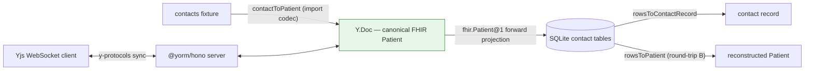

# example-fhir-patient-contacts

Contacts ⇄ FHIR Patient POC (PLAN.md Milestone 5, deliverable 2): a
phone-style contacts database (Apple `AddressBook.sqlitedb`-inspired schema)
that syncs **losslessly** with a canonical FHIR R4 `Patient` document.

The canonical object lives in a Y.Doc; the SQLite contact tables are
**projections** of it. Contacts enter through an import codec; edits arrive
over HTTP or a y-protocols WebSocket; rows update via the forward mapping
`fhir.Patient@1`. Live reverse sync (SQL → document) is deferred (Decision #3).

## Run it

```sh
pnpm install && pnpm build   # workspace deps resolve to dist

pnpm --filter example-fhir-patient-contacts seed   # fixture → Patient JSON + row counts
pnpm --filter example-fhir-patient-contacts demo   # full round trip incl. a live WebSocket edit
pnpm --filter example-fhir-patient-contacts dev    # Hono server on PORT (default 3000)
```

Scripts run from source via `tsx` (no build step needed for the scripts
themselves — but the `@yorm/*` workspace packages must be built).
`YORM_SQLITE_FILE=contacts-poc.db` persists to a file instead of in-memory.

With the dev server running: `GET /yorm/docs/Patient/c-100` returns the
materialized Patient, `ws://localhost:3000/yorm/ws/Patient/c-100` speaks
y-protocols sync + awareness.

## Data flow



## Contact ↔ Patient correspondence

| Contact side (Apple-inspired)                 | FHIR Patient side                                                                     |
| --------------------------------------------- | ------------------------------------------------------------------------------------- |
| `contact.first` / `middle` / `last`           | official `name.given[0]` / `given[1]` / `family`                                      |
| `contact.nickname`                            | `name` with `use: "usual"` (or `"nickname"`), `given[0]`                              |
| `contact.birthday`                            | `birthDate`                                                                           |
| `contact.image_ref`                           | `photo[0].url` (image refs only, Decision #7)                                         |
| `contact.organization`                        | extension `…/contact-organization`                                                    |
| `contact.note`                                | extension `…/contact-note`                                                            |
| `contact_multivalue` (property, label, value) | `telecom` (`system`, `use`, `value`); `element_id` = `id`                             |
| `contact_multivalue_entry` (street/city/…)    | `address` (`line`/`city`/`state`/`postalCode`/`country`)                              |
| `contact_raw_property` sidecar                | extensions `…/raw/<property>` (`valueString`)                                         |
| — (no columns)                                | `identifier`, `gender`, `active`, … stay **only** in the document ("keep the object") |

The table-level correspondence to `ABPerson`/`ABMultiValue` is documented in
[src/schema.ts](src/schema.ts) (Decision #5).

## Extension namespace

Unmapped **contact** fields ride on the Patient under
`https://yorm.dev/fhir/StructureDefinition/` (`YORM_EXTENSION_BASE` from
`@yorm/fhir`):

- `contact-organization`, `contact-note` — contact columns with no core
  Patient element;
- `raw/<property>` — the lossless sidecar (ringtone, social profiles, …),
  projected to `contact_raw_property`.

## What the tests prove (PLAN.md 5d — the lossless thesis)

- [test/roundtrip-a.test.ts](test/roundtrip-a.test.ts) — contacts record →
  Patient → fresh contact tables → record: canonical row equality, sidecar
  carries unmappables, second projection is idempotent.
- [test/roundtrip-b.test.ts](test/roundtrip-b.test.ts) — FHIR fixture →
  rows → `rowsToPatient` deep-equals the canonicalized input for every mapped
  field; unmapped fields stay in the document and never reach rows.
- [test/concurrent.test.ts](test/concurrent.test.ts) — two WebSocket clients
  edit different fields; both converge; rows contain both edits.
- [test/poc.test.ts](test/poc.test.ts) — concrete row values after seeding;
  session edits update rows; removals delete rows via reconciliation.

Canonicalization rules (element-id ordering, null dropping, name-id scope)
are documented in [src/importContacts.ts](src/importContacts.ts).
