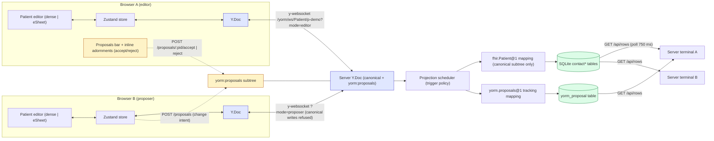
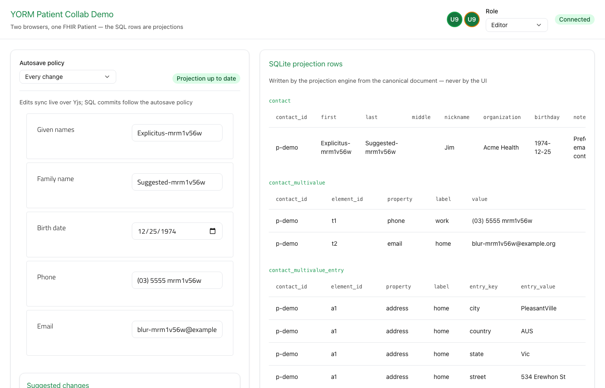

# patient-collab-demo

**🧪 Live sandbox: [yorm.os.mieweb.org](https://yorm.os.mieweb.org/)** — try it
without cloning; open the link in two windows to collaborate.

A collaborative FHIR **Patient** editor: two browsers edit the same Patient
live over Yjs, while a dark **Server terminal** window shows the relational
`contact*` rows the YORM projection engine derives from the canonical document
into SQLite — committed according to a selectable autosave policy. A mode
switcher turns a
browser into a **proposer** whose edits become reviewable suggestions instead
of direct writes, and a header view toggle switches between the demo's own
**dense editor** (default) and the **eSheet**-rendered form.

What it demonstrates:

- **Yjs ⇄ Zustand bridge** ([src/client/store.ts](src/client/store.ts)): the
  `Y.Doc` is the single source of truth. The store's `patient` slice is just
  `doc.getMap("resource").toJSON()` refreshed on every doc update; actions mutate
  Y types inside `doc.transact`. Awareness feeds a presence slice
  (`{clientId, name, color, focusedField}`).
- **Dense custom Patient editor** ([src/client/components/PatientEditor.tsx](src/client/components/PatientEditor.tsx)):
  the demo's own compact multi-column editor over the **entire** Patient object,
  generated from the field specs in
  [src/client/patientEditorFields.ts](src/client/patientEditorFields.ts) —
  identifier entries, active, gender, every name / telecom / address entry,
  birth date, photo URL, and the yorm extensions (organization, note). Fields
  that no SQL column covers (identifier, active, gender, …) still sync and
  persist — they live only in the canonical document ("keep the object") — and
  anything the editor has no input for renders as read-only JSON chips in the
  **unmapped extras** strip. A colored dot next to a field shows a peer editing
  it; open suggestions render **inline next to the field** (see below).
- **eSheet Patient form** ([src/client/components/PatientForm.tsx](src/client/components/PatientForm.tsx)):
  the alternate view, rendered by `@esheet/renderer` from a `FormDefinition`
  built from [src/client/patientFields.ts](src/client/patientFields.ts)
  (given/family names, birth date, phone, email). The eSheet form store and the
  Yjs-backed store are wired both ways, writing only when a value actually
  differs (echo-safe). The header **Editor: Dense | eSheet** toggle (also
  `?view=esheet`) swaps views over the same store/doc. The `@esheet/*` packages
  are **built from source** out of the [vendor/eSheet](../../vendor/eSheet)
  submodule — see [eSheet from source](#esheet-from-source) — and presence +
  suggestions render natively through the renderer's `collab` prop. The form
  definition itself is editable at runtime — see
  [Form config](#form-config-esheet-view).
- **UI shell** with `@mieweb/ui`: presence avatars, the autosave-policy
  dropdown, Save button (explicit mode), the **room status** dot + popup
  ([src/client/components/RoomStatus.tsx](src/client/components/RoomStatus.tsx)),
  and the **Server terminal** (below). The `@mieweb/ui`
  package is **built from source** out of the [vendor/ui](../../vendor/ui)
  submodule — see [@mieweb/ui from source](#miewebui-from-source).
- **Server terminal** ([src/client/components/ServerTerminal.tsx](src/client/components/ServerTerminal.tsx)):
  the page is deliberately staged as two windows. The light **Sample
  Application** window is the product a user would see; the dark **Server
  terminal** window is *not part of the application* — it is a debug view of
  the sample server's SQLite database (polled every 750 ms), the rows the
  projection engine writes from the shared document. A **Pop out** button
  opens it as its own browser window (`?pane=server`) so the main screen shows
  only the application — the popped-out window is a pure HTTP observer that
  never joins the Yjs room, so it adds no presence ghost. An **ⓘ** button in
  the title bar explains the window, and a **YORM log** at the bottom tails
  what the engine triggered (projection commits, policy switches, suggestion
  activity) since the page loaded — earlier history is deliberately skipped.
- **Playwright e2e** ([tests/](tests/)): convergence across two browser
  contexts, policy semantics (explicit → rows only after Save; on-blur →
  rows after blur), unmapped-field convergence, inline/mass proposal review,
  the view toggle, and the eSheet-native decorations + YAML form config
  ([tests/esheet.spec.ts](tests/esheet.spec.ts)).
- **Suggestion mode** ([src/client/components/ReviewPanel.tsx](src/client/components/ReviewPanel.tsx)):
  an editor/proposer mode switcher, inline suggestion adornments on the dense
  editor, a top accumulating proposals bar with mass actions, and the
  `yorm_proposal` tracking table in the server terminal — see
  [Write modes & proposed changes](#write-modes--proposed-changes).

## One-command startup

```sh
pnpm --filter patient-collab-demo esheet:build   # once: build vendor/eSheet (see below)
pnpm --filter patient-collab-demo ui:build       # once: build vendor/ui (see below)
pnpm --filter patient-collab-demo dev
```

This runs the YORM server (tsx, port **5178**) and the Vite dev server (port
**5173**, proxying `/yorm` + `/api` + WebSockets to 5178) concurrently. Open
http://localhost:5173 in two windows to collaborate.

Production mode (single port, used by the e2e suite):

```sh
pnpm --filter patient-collab-demo build   # vite build → dist/
pnpm --filter patient-collab-demo start   # serves client + API on :5178
```

## Data flow



The server ([src/server.ts](src/server.ts)) reuses the whole POC stack from
[examples/fhir-patient-contacts](../fhir-patient-contacts/README.md)
(`createPocServer` + `seedContacts`) and adds the demo write modes
(`onAuthorizeWrite`), the `yorm_proposal` tracking projection
(`proposalTrackingMapping`), `GET /api/rows`, and static serving of the built
client.

## Autosave policies

Selected in the header dropdown → `POST /yorm/docs/Patient/p-demo/policy`.
Document sync over Yjs is **always live**; the policy only controls when the
SQLite projection commits.

| Policy       | Projection commits…                                             |
| ------------ | --------------------------------------------------------------- |
| Every change | on every document update                                          |
| On blur      | when a field blur posts `POST …/signal {kind:"blur"}` (default)  |
| Idle (30 s)  | after 30 s without edits                                          |
| Explicit     | only when the Save button posts `POST …/flush`                   |

The projection state (polled from
`GET /yorm/docs/Patient/p-demo/projection-state`) is shown by the room-status
dot below, which turns amber while the projection is behind the document.

The scheduler is **per document, shared by every window** (a simplification in
the current `@yorm/yjs`), so the dropdown is not a local preference: the same poll reads
back `policy` and moves the picker, which is why another window's pick — or a
server restart — visibly changes yours.

## Room status

The header ends with a single **room status dot** — `@mieweb/ui`'s
`CollabStatus` in `compact` mode, bound to the live `Y.Doc` + `y-websocket`
provider by `useYjsCollabStatus`
([src/client/components/RoomStatus.tsx](src/client/components/RoomStatus.tsx)).
The dot alone carries both halves of “is my work safe”: green when the room is
synced and the projection has caught up, amber while connecting **or** while
the projection is behind (`attention`, from the polled projection state). All
of it reaches assistive tech through the trigger's accessible name — “Room
status — Connected — Unsaved projection changes — Ann is editing”. Clicking it
opens a popup with:

- the attention line, if any;
- the document, socket URL, client id and your own identity (name · role · mode);
- **In the room (N)** — the occupants, each with their presence color;
- **Room activity** — a merged, newest-first log of peers joining/leaving,
  document updates, sync transitions, field edits, autosave-policy changes,
  suggestions proposed/accepted/rejected, and every SQL projection commit
  (statement count + document version).

Long values (socket URL, log details) are clipped to one line so the panel
stays narrow. Hover any of them for the full text in a tooltip, or press the
**Wrap long values** button next to the close button to unclip every value at
once.

The Yjs-derived half of that log comes from the hook; the demo-specific
entries are appended by the store (`events` in
[src/client/store.ts](src/client/store.ts)) and merged in `RoomStatus`.

## Roles — the policy lens (role-security POC)

The header's **Role** select names WHO is connecting (the **Mode** select
names HOW a connection writes). Roles with a policy sync a **derived,
redacted Y.Doc** served by the `@yorm/hono` policy lens — hidden fields never
reach the browser, and every write is validated server-side before it merges
back into the canonical document (see the
[@yorm/yjs role policies](../../packages/yjs/README.md#role-policies--the-policy-lens-role-security-poc)):

| Role         | Sees                                      | May edit           |
| ------------ | ----------------------------------------- | ------------------ |
| Physician    | everything (no policy — canonical doc)    | everything         |
| Nurse        | everything                                | telecom, addresses |
| Receptionist | demographics only (no addresses/ids/exts) | names, telecom     |

The policies live in [src/rolePolicies.ts](src/rolePolicies.ts), shared by
the server (which passes them as `rolePolicies` to `createHonoYorm`) and the
client (which renders protected sections read-only — cosmetic only, the lens
enforces). The role travels as `?role=` on the WebSocket URL; switching roles
reloads the page because a lens role syncs a different (derived) server
document, so the client needs a fresh Y.Doc. Try it: open one window as
physician and another at `/?role=receptionist` — the receptionist never
receives the address, yet a name fix flows back to the physician live.
[tests/roles.spec.ts](tests/roles.spec.ts) covers both directions.

## Write modes & proposed changes

The header's **Mode** select switches between:

| Mode     | Canonical writes | Proposals                      |
| -------- | ---------------- | ------------------------------ |
| Editor   | direct (Yjs)     | reviews: accept / reject       |
| Proposer | refused          | creates via `POST …/proposals` |

This is demo-level auth: the client claims its mode via `?mode=` on the
WebSocket URL and an `X-Demo-Mode` header on REST calls; the server's
`onAuthorizeWrite` hook lets proposers write only the `"proposals"` scope
(canonical PUT/PATCH/accept/reject get 403). The `@yorm/hono` plugin
additionally guards `?mode=proposer` WebSocket connections server-side: a sync
update that would change the canonical subtree is refused and the socket is
closed with 1008 — proposer edits can never leak into the document.

The proposals flow: a proposer's field edits are debounced into semantic
change intents (`{ path, op: "set", proposedValue, actor }`, path taken from
the field specs in [src/client/patientFields.ts](src/client/patientFields.ts) /
[src/client/patientEditorFields.ts](src/client/patientEditorFields.ts)) and
stored in the `yorm:proposals` subtree of the same Y.Doc.

In the dense editor an open suggestion renders **inline next to the field**
(linked via `aria-describedby`): the proposed value and actor, plus — for
editors — Accept / Reject buttons right there. A stale accept (the canonical
value changed since the proposal, HTTP 409) surfaces an inline "changed since
proposed" state offering **Accept anyway** or Reject. Proposers see their own
pending suggestion as a visually distinct chip without action buttons. The
eSheet view renders the equivalent adornments **natively** — the demo passes
the renderer a `CollabDecorations` object (`presenceByField`,
`proposalsByField`, `canResolve`, `onProposalAction`, `formatValue`; declared
in `@esheet/core`, rendered by `@esheet/renderer`'s `FieldNode`) built from
the store's peers, proposals, and `useProposalActions`.

The **Suggested changes** bar sits on top of the editor pane and accumulates
every change intent of the session: open ones first (with per-item Accept /
Reject for editors), then resolved ones greyed out with their status. It is
collapsible (`<details>`, starts collapsed with a chevron indicator) with an
open-count badge, and the list is height-capped so accumulation never reflows
the page. Editors also get mass
actions — **Accept all** / **Reject all** — which resolve the open proposals
sequentially; conflicted accepts stay listed with their inline conflict state.

Because the document codec materializes only the canonical subtree, the
`contact*` rows never see an unaccepted change — while the `yorm_proposal`
tracking table (also in the server terminal) shows every intent and its status
live: pending → a `yorm_proposal` row appears but contact rows are unchanged;
accept → contact rows update and the row flips to `accepted`; reject → only
the status changes.

## Accessibility & i18n

- All interactive elements have ARIA labels; presence and row updates are
  announced through an `aria-live="polite"` region; focus indicators are
  visible.
- Every user-facing string lives in [src/client/i18n.ts](src/client/i18n.ts)
  (`t(key)` lookup, English defaults) — no hardcoded literals in components.
- Styling is per-component SCSS using only `--mieweb-*` design tokens.

## eSheet from source

The `@esheet/core|renderer|builder` packages come from the
[vendor/eSheet](../../vendor/eSheet) git submodule (branch
`yorm-collab-decorations`, which adds the optional `collab` decoration API),
not from npm. Build them once (and after every submodule change):

```sh
git submodule update --init
pnpm --filter patient-collab-demo esheet:build
```

The script runs `npm ci || npm install` plus the Nx builds (including the
Tailwind CSS steps) inside the submodule; outputs land in
`vendor/eSheet/packages/*/dist`. The demo consumes those dists through Vite
`resolve.alias` + tsconfig `paths` (see [vite.config.ts](vite.config.ts)) —
`file:` dependencies don't work here because the submodule packages reference
each other by unpublished versions that pnpm would try to fetch from the
registry. Their runtime deps resolve from `vendor/eSheet/node_modules`; React
stays this example's copy via `resolve.dedupe` (+ a `react` tsconfig `paths`
pin for types). See the [eSheet repo](https://github.com/mieweb/eSheet) for
the packages' own docs.

## @mieweb/ui from source

`@mieweb/ui` also comes from a git submodule — [vendor/ui](../../vendor/ui),
branch `feat/collab-status` ([mieweb/ui#350](https://github.com/mieweb/ui/pull/350))
— because `CollabStatus` / `useYjsCollabStatus` are not in a published release
yet. This demo additionally extends the component with the `compact` trigger,
the `attention` seam, the occupants section and the wrap toggle it needs;
those edits live **inside the submodule** so they can be proposed back to that
PR.

```sh
git submodule update --init --recursive
pnpm --filter patient-collab-demo ui:build
```

The script runs `npm ci || npm install` plus `npm run build` (tsup + Tailwind)
inside the submodule; the demo consumes `vendor/ui/dist` through Vite
`resolve.alias` + tsconfig `paths`, exactly like eSheet. Drop the submodule
and switch back to the registry once the PR ships.

## Form config (eSheet view)

The eSheet view's collapsible **Form config** panel
([src/client/components/FormConfigPanel.tsx](src/client/components/FormConfigPanel.tsx))
makes the Patient `FormDefinition` editable at runtime:

- **YAML** tab: the current definition as YAML (js-yaml); **Apply** parses and
  validates it with `@esheet/core`'s `formDefinitionSchema` and re-renders the
  form. Parse/validation errors show inline (`role=alert`) and never break
  the live form.
- **Browser** tab: `@esheet/builder`'s visual editor (lazy-loaded from the
  same submodule) on the same definition; **Apply** commits the built
  definition through the same validation.
- Fields whose id matches a [patientFields.ts](src/client/patientFields.ts)
  spec stay two-way bound to the document; unknown ids render but are listed
  as unbound under the form. The applied definition persists per document in
  localStorage; **Reset to default** clears it.

## Notes

- The **dense** view is the default; `?view=esheet` (or the header toggle)
  renders the eSheet form instead.
- `@esheet/renderer` declares a React ≥ 19 peer but uses no 19-only APIs; the
  demo runs it on React 18 with Vite `resolve.dedupe` for react/react-dom.
- The phone field uses eSheet's plain `string` input type (not `tel`): the tel
  mask assumes US numbers and corrupts the fixture's international value.



## Tests

```sh
pnpm --filter patient-collab-demo typecheck
pnpm --filter patient-collab-demo test:e2e   # Playwright (chromium)
```

The e2e config builds the client and runs the single prod server on :5178 for
determinism. Specs live in `tests/` so the root vitest suite (which globs
`test/**/*.test.ts`) does not pick them up. Field locators go through
accessible labels, which the dense editor and the eSheet view share for the
common fields; all edited values are run-unique (the server may be reused
with persisted state, so constant values would be no-op fills).
