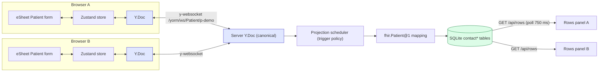

# patient-collab-demo

A collaborative FHIR **Patient** editor (PLAN.md Milestone 6): two browsers edit the
same Patient live over Yjs, while a SQLite projection panel shows the relational
`contact*` rows the YORM projection engine derives from the canonical document —
committed according to a selectable autosave policy.

What it demonstrates:

- **6a — Yjs ⇄ Zustand bridge** ([src/client/store.ts](src/client/store.ts)): the
  `Y.Doc` is the single source of truth. The store's `patient` slice is just
  `doc.getMap("resource").toJSON()` refreshed on every doc update; actions mutate
  Y types inside `doc.transact`. Awareness feeds a presence slice
  (`{clientId, name, color, focusedField}`).
- **6b — eSheet Patient form** ([src/client/components/PatientForm.tsx](src/client/components/PatientForm.tsx)):
  the form is rendered by `@esheet/renderer` from a `FormDefinition` built from
  [src/client/patientFields.ts](src/client/patientFields.ts) (given/family names,
  birth date, phone, email). The eSheet form store and the Yjs-backed store are
  wired both ways, writing only when a value actually differs (echo-safe).
- **6c — UI shell** with `@mieweb/ui`: presence avatars, connection status, the
  autosave-policy dropdown, Save button (explicit mode), an "unsaved projection
  changes" indicator, and the live SQLite rows panel (polled every 750 ms).
- **6d — Playwright e2e** ([tests/](tests/)): convergence across two browser
  contexts and policy semantics (explicit → rows only after Save; on-blur →
  rows after blur).

## One-command startup

```sh
pnpm --filter patient-collab-demo dev
```

This runs the YORM server (tsx, port **5178**) and the Vite dev server (port
**5173**, proxying `/yorm` + `/api` + WebSockets to 5178) concurrently. Open
http://localhost:5173 in two windows to collaborate.

Production mode (single port, used by the e2e suite):

```sh
pnpm --filter patient-collab-demo build   # vite build → dist/
pnpm --filter patient-collab-demo start   # serves client + API on :5178
```

## Data flow



The server ([src/server.ts](src/server.ts)) reuses the whole POC stack from
[examples/fhir-patient-contacts](../fhir-patient-contacts/README.md)
(`createPocServer` + `seedContacts`) and adds `GET /api/rows` plus static
serving of the built client.

## Autosave policies

Selected in the header dropdown → `POST /yorm/docs/Patient/p-demo/policy`.
Document sync over Yjs is **always live**; the policy only controls when the
SQLite projection commits.

| Policy       | Projection commits…                                   |
| ------------ | ----------------------------------------------------- |
| Every change | on every document update (default)                    |
| On blur      | when a field blur posts `POST …/signal {kind:"blur"}` |
| Idle (30 s)  | after 30 s without edits                              |
| Explicit     | only when the Save button posts `POST …/flush`        |

The "unsaved projection changes" indicator polls
`GET /yorm/docs/Patient/p-demo/projection-state`.

## Accessibility & i18n

- All interactive elements have ARIA labels; presence and row updates are
  announced through an `aria-live="polite"` region; focus indicators are
  visible.
- Every user-facing string lives in [src/client/i18n.ts](src/client/i18n.ts)
  (`t(key)` lookup, English defaults) — no hardcoded literals in components.
- Styling is per-component SCSS using only `--mieweb-*` design tokens.

## Notes

- `@esheet/renderer@0.0.3` declares a React ≥ 19 peer but uses no 19-only
  APIs; the demo runs it on React 18 with Vite `resolve.dedupe` for
  react/react-dom.
- The phone field uses eSheet's plain `string` input type (not `tel`): the tel
  mask assumes US numbers and corrupts the fixture's international value.


## Tests

```sh
pnpm --filter patient-collab-demo typecheck
pnpm --filter patient-collab-demo test:e2e   # Playwright (chromium)
```

The e2e config builds the client and runs the single prod server on :5178 for
determinism. Specs live in `tests/` so the root vitest suite (which globs
`test/**/*.test.ts`) does not pick them up.
