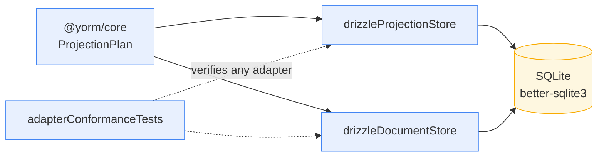

# @yorm/drizzle

Drizzle-backed persistence adapters for YORM (PLAN.md Milestone 4): a
`DocumentStore` + `ProjectionStore` on SQLite, plus the **adapter conformance
suite** that every future backend (M9: PGlite, Postgres, MariaDB, MongoDB)
must pass.



## Layout

| Module                  | Contents                                                                   |
| ----------------------- | -------------------------------------------------------------------------- |
| `src/schema.ts`         | Drizzle sqlite-core definitions of the `yorm_*` system tables              |
| `src/document-store/`   | `drizzleDocumentStore(db)` — snapshots + update log                        |
| `src/projection-store/` | `drizzleProjectionStore(db, options?)` — transactional plan application    |
| `src/conformance.ts`    | Reusable adapter conformance suite (framework-agnostic, vitest-compatible) |
| `src/sqlite.ts`         | `createSqliteAdapter`, `YORM_SQLITE_DDL`, `resolveBackend` (`YORM_DB`)     |

## Quick start (SQLite)

```ts
import { createSqliteAdapter } from "@yorm/drizzle";

const adapter = createSqliteAdapter({ file: "yorm.db" }); // default ":memory:"
adapter.migrate(); // CREATE TABLE IF NOT EXISTS yorm_document / yorm_update / yorm_projection_state

await adapter.documents.saveSnapshot(doc);
await adapter.projections.applyPlan(plan); // all operations + checkpoint in ONE transaction
adapter.close();
```

## Stores

### `drizzleDocumentStore(db)`

Implements the core `DocumentStore` contract on `yorm_document` /
`yorm_update`: snapshot upsert (`createdAt` preserved on replace), append-only
update log, `listUpdates` ordered by version with `sinceVersion` filtering,
and `listDocuments` for replay.

> Note: core's `DocumentUpdate` carries no `documentType`, so updates are
> keyed by `documentId` alone; `yorm_update.document_type` is nullable and
> reserved.

### `drizzleProjectionStore(db, options?)`

Implements the core `ProjectionStore` contract:

- **`applyPlan(plan)`** runs every upsert and reconcile plus the checkpoint
  advance in one synchronous better-sqlite3 transaction — a partially applied
  plan is never observable.
- **Upserts** are `INSERT … ON CONFLICT (key columns) DO UPDATE SET` limited
  to the plan's `ownedColumns` — unowned columns are never touched (column
  ownership). Projection tables must therefore cover the mapping's key
  columns with a `PRIMARY KEY` or `UNIQUE` constraint.
- **Reconciles** are scoped deletes: `DELETE … WHERE <scope> AND (key…) NOT IN
(VALUES …)`; with zero `keepKeys` the whole scope is cleared (never an
  unconstrained delete).
- **Raw-SQL with validated identifiers** is the core mechanism: application
  projection tables are dynamic and user-owned, so table and column names are
  validated against `/^[A-Za-z_][A-Za-z0-9_]*$/` (anything else throws — SQL
  injection guard) and all values are bound as placeholders (booleans become
  `0`/`1`). Optionally register Drizzle table objects via
  `options.tables[tableName] = { table }` to resolve trusted table names from
  the table object instead.
- **`recordFailure(checkpoint, error)`** upserts the state row with
  `status: "error"` without touching projection tables; a later successful
  `applyPlan` recovers it to `ok`.
- **`listFailures()`** (core's optional `ProjectionStore` member) returns every
  state row with `status: "error"` — the quarantine set that
  `retryFailedProjections` in `@yorm/yjs` re-runs.

## Adapter conformance suite (for M9 backends)

The suite ships **in the package** and takes the test API by injection, so it
has no dependency on any test framework. A new backend only implements an
`AdapterFactory` and registers the suite:

```ts
// packages/drizzle/test/my-backend.test.ts
import { beforeEach, describe, expect, it } from "vitest";
import { adapterConformanceTests, type AdapterFactory } from "@yorm/drizzle";

const factory: AdapterFactory = {
  name: "my-backend",
  async create() {
    // connect, migrate the yorm_* tables, and return:
    return {
      documents, // DocumentStore
      projections, // ProjectionStore
      queryRows: async (table) => /* SELECT * FROM table */,
      setup: async (statements) => /* execute sample-table DDL / seeds */,
      close: async () => /* disconnect */,
    };
  },
};

adapterConformanceTests(factory, { describe, it, expect, beforeEach });
```

Every test creates a fresh adapter via `factory.create()`, runs
`CONFORMANCE_SAMPLE_DDL` through `setup(...)`, and closes it — adapters never
share state. Coverage: snapshot round-trip (bytes equal), missing-doc `null`,
snapshot upsert, update ordering + `sinceVersion`, `listDocuments`, plan
application + idempotent replay, column ownership, reconciliation deletes,
zero-keepKeys scope clearing, checkpoint advance, failure recording, and
transactionality (a failing operation leaves no partial rows and no
checkpoint).

## Backend selection (`YORM_DB`)

```ts
import { resolveBackend } from "@yorm/drizzle";

const backend = resolveBackend(process.env.YORM_DB); // "sqlite"
```

Only `"sqlite"` is wired up in the vertical slice; `pglite`, `postgres`,
`mariadb`, and `mongodb` throw a "planned in Milestone 9" error, and anything
else throws with the supported list. Example code can switch on the resolved
name so M9 backends slot in without touching it.
