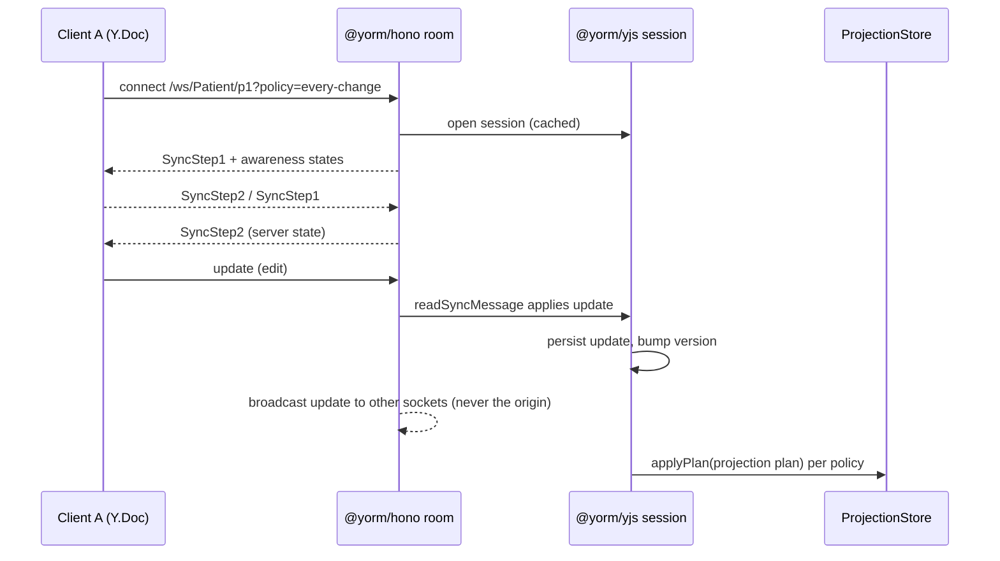

# @yorm/hono

Pluggable Hono server component (PLAN.md Milestone 3, deliverable 1):
`app.route("/yorm", createHonoYorm(yorm))` turns any Hono app into a YORM
server. The plugin only sees `Yorm` interfaces from
[@yorm/yjs](../yjs/README.md) — it has **no dependency on any DB package**.

## Mounting (Node)

Hono's `upgradeWebSocket` is runtime-specific (Node/Bun/Deno/Cloudflare), so
the plugin takes it via injection instead of locking in a runtime. On Node:

```ts
import { serve } from "@hono/node-server";
import { createNodeWebSocket } from "@hono/node-ws";
import { Hono } from "hono";
import { createHonoYorm } from "@yorm/hono";

const app = new Hono();
const { upgradeWebSocket, injectWebSocket } = createNodeWebSocket({ app });

app.route(
  "/yorm",
  createHonoYorm(yorm, {
    upgradeWebSocket, // mounts GET /yorm/ws/:type/:id
    onAuthorize: (ctx, { type, id }) => checkToken(ctx, type, id),
    defaultPolicy: { kind: "idle", ms: 30_000 },
    maxLagMs: 120_000,
  }),
);

const server = serve({ fetch: app.fetch, port: 3000 });
injectWebSocket(server);
```

Without `options.upgradeWebSocket`, `createHonoYorm` mounts the HTTP routes
only; mount the WebSocket route separately with:

```ts
app.route("/yorm", createHonoYormWebSocket(yorm, upgradeWebSocket, options));
```

## HTTP routes

All routes are JSON and run `onAuthorize` first (`403` on refusal).
Malformed bodies yield `400`; unexpected errors yield `500 { error }`.

| Method | Path                               | Body                                    | Response                                        |
| ------ | ---------------------------------- | --------------------------------------- | ----------------------------------------------- |
| GET    | `/docs/:type/:id`                  | —                                       | `{ object, version }`, `404` if never persisted |
| PUT    | `/docs/:type/:id`                  | the document object                     | `{ version }` (semantic replace via codec)      |
| PATCH  | `/docs/:type/:id`                  | `{ path, value? }` or an array of those | `{ version }` (omit `value` to remove)          |
| GET    | `/docs/:type/:id/projection-state` | —                                       | `{ pending, version, lastError?, checkpoints }` |
| POST   | `/docs/:type/:id/flush`            | —                                       | `{ version, pending }` (projects now)           |
| POST   | `/docs/:type/:id/signal`           | `{ kind: "blur" \| "flush" }`           | `{ version, pending }`                          |
| POST   | `/docs/:type/:id/policy`           | a `ProjectionTriggerPolicy`             | `204`                                           |

### Proposal routes (PLAN.md M7, suggestion mode)

Proposals are semantic change intents in the document's `yorm:proposals`
subtree — see [@yorm/yjs proposals](../yjs/README.md#proposed-changes-suggestion-mode).
Each write route also runs `onAuthorizeWrite(ctx, docRef, scope)` with the
scope shown (`403` on refusal). Accepting **writes canonical state**, so the
accept routes require the `"canonical"` scope.

| Method | Path                                           | Scope       | Body                                  | Response                                                  |
| ------ | ---------------------------------------------- | ----------- | ------------------------------------- | --------------------------------------------------------- |
| GET    | `/docs/:type/:id/proposals`                    | —           | — (`?status=` filter)                 | `{ proposals: ChangeIntent[] }`                           |
| POST   | `/docs/:type/:id/proposals`                    | `proposals` | `{ path, op, proposedValue?, actor }` | `201 { proposal }`                                        |
| POST   | `/docs/:type/:id/proposals/:pid/accept`        | `canonical` | `{ resolvedBy? }`                     | `{ conflict: false, version }`, stale → `409` (see below) |
| POST   | `/docs/:type/:id/proposals/:pid/accept-anyway` | `canonical` | `{ resolvedBy? }`                     | `{ conflict: false, version }`                            |
| POST   | `/docs/:type/:id/proposals/:pid/reject`        | `canonical` | `{ resolvedBy? }`                     | `{ ok: true }`                                            |
| DELETE | `/docs/:type/:id/proposals/:pid`               | `proposals` | —                                     | `204` (withdraw)                                          |

A **stale accept** (the canonical value moved since the proposal was made)
returns `409 { conflict: true, currentValue }` without applying or resolving
anything — the caller decides (accept-anyway / reject / re-propose). Unknown
proposal ids yield `404`; operating on an already-resolved proposal yields
`409`.

Notes (v1 simplifications, by design):

- **Not found** is defined pragmatically: no stored snapshot **and**
  in-memory version 0 — merely opening a session never creates a document.
- **PATCH** applies one semantic transaction per operation and addresses the
  JSON codec's default root key (`resource`).
- **Policy is per document, not per HTTP session**: HTTP is stateless, and
  `@yorm/yjs` shares one scheduler per document, so a policy set via this
  route (or a WebSocket `?policy=` param) applies to everyone editing the
  document. True per-session policies arrive with a later transport phase.
- `projection-state.checkpoints` contains one entry per mapping registered
  for `:type`: `{ mappingName, mappingVersion, state }`, where `state` is the
  stored `ProjectionStateRecord` (or `null` if never projected).
- The plugin caches one document session per `type/id` for its lifetime
  (sessions are never closed per request).

## WebSocket `/ws/:type/:id`

Speaks the standard Yjs wire protocol (`y-protocols/sync` +
`y-protocols/awareness`), so any y-websocket-compatible client connects
as-is. Binary frames only. Unauthorized upgrades are closed with code
`1008`.

Query params:

- `?policy=every-change|on-blur|idle|explicit` — sets the projection trigger
  policy on open (see [PLAN.md decision #10](../../PLAN.md)); invalid values
  are ignored.
- `?idleMs=<ms>` — debounce for `policy=idle`.
- `?mode=proposer` — the connection may only write the **proposals** subtree;
  see “Write modes & the canonical-write guard” below.
- `?role=<role>` matching a policy in `options.rolePolicies` — the connection
  syncs a redacted **policy lens** instead of the canonical doc; see “Role
  policies” below. (`?mode=` names HOW a connection writes; `?role=` names
  WHO is connecting.)

### Write modes & the canonical-write guard (PLAN.md M7)

A WebSocket connection's write scope is chosen at upgrade time: `?mode=proposer`
connections are authorized via `onAuthorizeWrite(ctx, docRef, "proposals")`,
all others via `onAuthorizeWrite(ctx, docRef, "canonical")` (refusal closes
with `1008`; v1 has no read-only sockets).

On **proposer** connections, incoming sync updates that would modify the
canonical root map are refused. Full CRDT-level per-subtree write refusal is
complex, so v1 validates each incoming update before applying it
(`guardCanonicalWrites`): the live doc's state is replayed onto a scratch
`Y.Doc`, the update is applied there, and the canonical subtree's JSON is
compared before/after. If it changed, the update is **not applied** and the
socket is closed with `1008`; proposals-subtree updates flow normally.

Tradeoffs (documented, v1): proposer connections pay an encode + double-apply
on a scratch doc per incoming update (editor connections are unaffected); a
mixed update that touches both subtrees is refused as a whole; a proposer
that made offline canonical edits is disconnected on re-sync. Partial revert
of mixed updates is a future extension.

The guard is **write** authorization only. Every synchronized participant
receives the whole `Y.Doc` — the canonical resource and all pending
proposals — so a `Y.Doc` is the confidentiality boundary, not the role. See
the root README's [Security](../../README.md#security) section. For
per-role **read** redaction, see “Role policies” below.



Room behavior: the plugin keeps one room per document (socket set + shared
`Awareness`). Doc updates fan out through `session.subscribe` to every
socket **except** the origin socket. On close, the socket's awareness client
ids are removed; when the last socket leaves, the room is torn down (the
cached session stays open so projections continue).

### Role policies (policy lens, role-security POC)

Pass developer-defined [`RolePolicy`](../yjs/README.md#role-policies--the-policy-lens-role-security-poc)
objects and the WebSocket route enforces them:

```ts
createHonoYorm(yorm, { upgradeWebSocket, rolePolicies: [receptionist, nurse] });
```

When a connection's `?role=` matches a policy for the document type, it
joins a **per-(document, role)** room that syncs the lens's derived doc:

- **reads** are redacted to the policy's `view` — hidden data never reaches
  the socket (the lens doc is the confidentiality boundary);
- **writes** are validated by the policy's `canWrite`; a violating update is
  never applied and the socket is closed with `1008` (mirroring the
  canonical-write guard); allowed changes are written back to the canonical
  doc, so canonical rooms and other lens rooms see them (and vice versa).

Roles without a policy keep the canonical rooms above, unchanged. A real
deployment must derive the role from the authenticated principal (session /
token) inside `onAuthorize` — the query param alone is a claim, not a proof.

**POC caveat:** the HTTP routes are not policy-aware yet — deny REST access
for lens roles via `onAuthorize`/`onAuthorizeWrite`.

## Options

```ts
interface HonoYormOptions {
  onAuthorize?: (ctx: Context, docRef: { type: string; id: string }) => boolean | Promise<boolean>;
  onAuthorizeWrite?: (
    ctx: Context,
    docRef: { type: string; id: string },
    scope: "canonical" | "proposals",
  ) => boolean | Promise<boolean>; // per-subtree write rules (PLAN.md M7)
  rolePolicies?: RolePolicy[]; // policy-lens roles (role-security POC), see above
  defaultPolicy?: ProjectionTriggerPolicy; // applied when a session is opened
  maxLagMs?: number; // plugin-level safety flush cap for deferred policies
  upgradeWebSocket?: UpgradeWebSocket; // lets createHonoYorm mount /ws itself
}
```

Codec selection is per document type inside `Yorm` (`createYorm({ codecs })`)
— the plugin adds nothing there.
