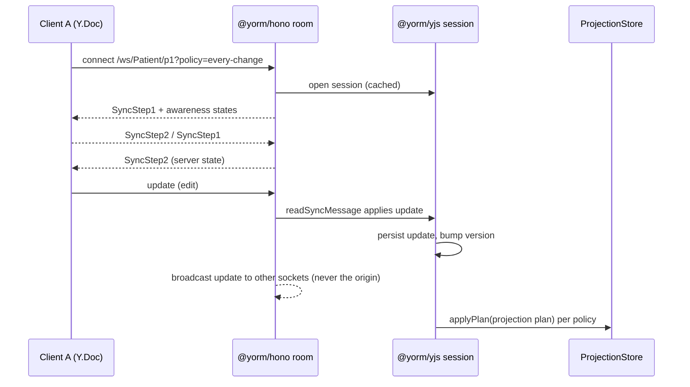

# @yorm/hono

Pluggable Hono server component (PLAN.md Milestone 3, deliverable 1):
`app.route("/yorm", createHonoYorm(yorm))` turns any Hono app into a YORM
server. The plugin only sees `Yorm` interfaces from
[@yorm/yjs](../yjs/README.md) — it has **no dependency on any DB package**.

## Mounting (Node)

Hono's `upgradeWebSocket` is runtime-specific (Node/Bun/Deno/Cloudflare), so
the plugin takes it via injection instead of locking in a runtime. On Node:

```ts
import { serve } from "@hono/node-server";
import { createNodeWebSocket } from "@hono/node-ws";
import { Hono } from "hono";
import { createHonoYorm } from "@yorm/hono";

const app = new Hono();
const { upgradeWebSocket, injectWebSocket } = createNodeWebSocket({ app });

app.route(
  "/yorm",
  createHonoYorm(yorm, {
    upgradeWebSocket, // mounts GET /yorm/ws/:type/:id
    onAuthorize: (ctx, { type, id }) => checkToken(ctx, type, id),
    defaultPolicy: { kind: "idle", ms: 30_000 },
    maxLagMs: 120_000,
  }),
);

const server = serve({ fetch: app.fetch, port: 3000 });
injectWebSocket(server);
```

Without `options.upgradeWebSocket`, `createHonoYorm` mounts the HTTP routes
only; mount the WebSocket route separately with:

```ts
app.route("/yorm", createHonoYormWebSocket(yorm, upgradeWebSocket, options));
```

## HTTP routes

All routes are JSON and run `onAuthorize` first (`403` on refusal).
Malformed bodies yield `400`; unexpected errors yield `500 { error }`.

| Method | Path                               | Body                                    | Response                                        |
| ------ | ---------------------------------- | --------------------------------------- | ----------------------------------------------- |
| GET    | `/docs/:type/:id`                  | —                                       | `{ object, version }`, `404` if never persisted |
| PUT    | `/docs/:type/:id`                  | the document object                     | `{ version }` (semantic replace via codec)      |
| PATCH  | `/docs/:type/:id`                  | `{ path, value? }` or an array of those | `{ version }` (omit `value` to remove)          |
| GET    | `/docs/:type/:id/projection-state` | —                                       | `{ pending, version, lastError?, checkpoints }` |
| POST   | `/docs/:type/:id/flush`            | —                                       | `{ version, pending }` (projects now)           |
| POST   | `/docs/:type/:id/signal`           | `{ kind: "blur" \| "flush" }`           | `{ version, pending }`                          |
| POST   | `/docs/:type/:id/policy`           | a `ProjectionTriggerPolicy`             | `204`                                           |

Notes (v1 simplifications, by design):

- **Not found** is defined pragmatically: no stored snapshot **and**
  in-memory version 0 — merely opening a session never creates a document.
- **PATCH** applies one semantic transaction per operation and addresses the
  JSON codec's default root key (`resource`).
- **Policy is per document, not per HTTP session**: HTTP is stateless, and
  `@yorm/yjs` shares one scheduler per document, so a policy set via this
  route (or a WebSocket `?policy=` param) applies to everyone editing the
  document. True per-session policies arrive with a later transport phase.
- `projection-state.checkpoints` contains one entry per mapping registered
  for `:type`: `{ mappingName, mappingVersion, state }`, where `state` is the
  stored `ProjectionStateRecord` (or `null` if never projected).
- The plugin caches one document session per `type/id` for its lifetime
  (sessions are never closed per request).

## WebSocket `/ws/:type/:id`

Speaks the standard Yjs wire protocol (`y-protocols/sync` +
`y-protocols/awareness`), so any y-websocket-compatible client connects
as-is. Binary frames only. Unauthorized upgrades are closed with code
`1008`.

Query params:

- `?policy=every-change|on-blur|idle|explicit` — sets the projection trigger
  policy on open (see [PLAN.md decision #10](../../PLAN.md)); invalid values
  are ignored.
- `?idleMs=<ms>` — debounce for `policy=idle`.



Room behavior: the plugin keeps one room per document (socket set + shared
`Awareness`). Doc updates fan out through `session.subscribe` to every
socket **except** the origin socket. On close, the socket's awareness client
ids are removed; when the last socket leaves, the room is torn down (the
cached session stays open so projections continue).

## Options

```ts
interface HonoYormOptions {
  onAuthorize?: (ctx: Context, docRef: { type: string; id: string }) => boolean | Promise<boolean>;
  defaultPolicy?: ProjectionTriggerPolicy; // applied when a session is opened
  maxLagMs?: number; // plugin-level safety flush cap for deferred policies
  upgradeWebSocket?: UpgradeWebSocket; // lets createHonoYorm mount /ws itself
}
```

Codec selection is per document type inside `Yorm` (`createYorm({ codecs })`)
— the plugin adds nothing there.
